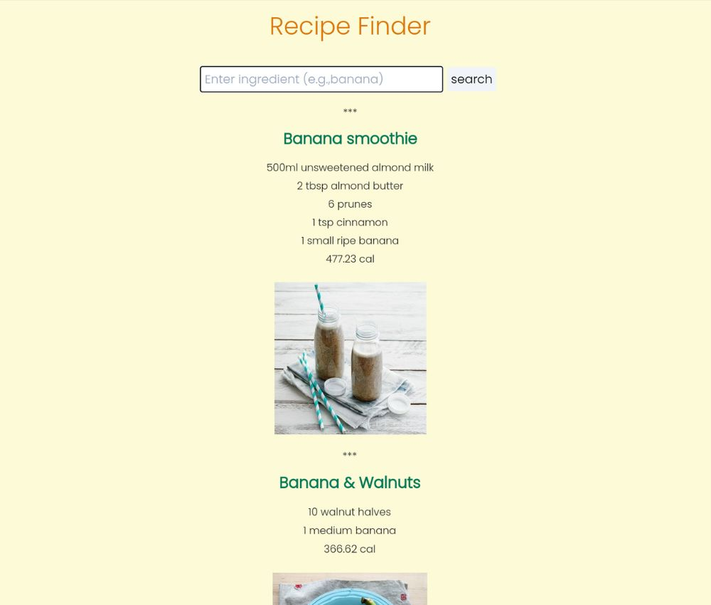

# 🍽 Recipe Finder 🔍
## Mini Application for API Fetch / React Vite Practice

### Tools I used
  
  
  
  
   
  
  

This application utilizes the capabilities of the Edamam API for its functionality.

## Edamam API

Integrate Edamam's Recipe Search API to seamlessly embed a diverse recipe database and advanced recipe search functionalities into your websites or mobile applications.   
[Edamam API - Explore the Recipe Search API](https://developer.edamam.com/edamam-recipe-api)

### Built using React with Vite
Utilizing Vite's agile development environment to expedite code compilation and enhance development velocity.

### Deployed on Vercel
Making use of its streamlined hosting platform to guarantee scalability, reliability, and exceptional performance for end users.  

Indulge in a diverse array of delectable recipes!   
Explore now with [Recipe Finder](https://recipe-finder-yukosuga.vercel.app/) 🍳✨